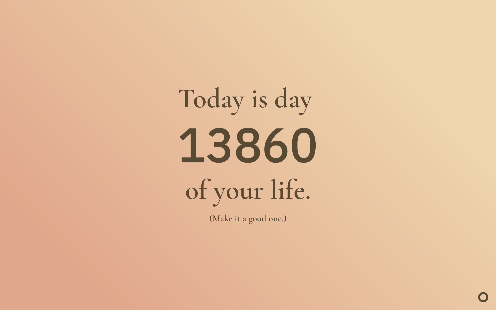
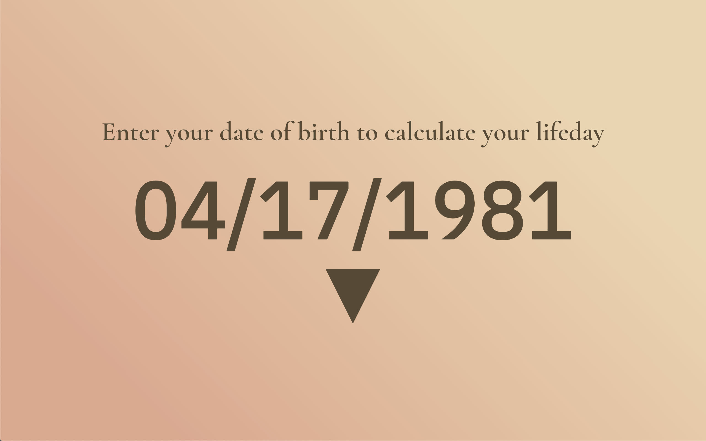
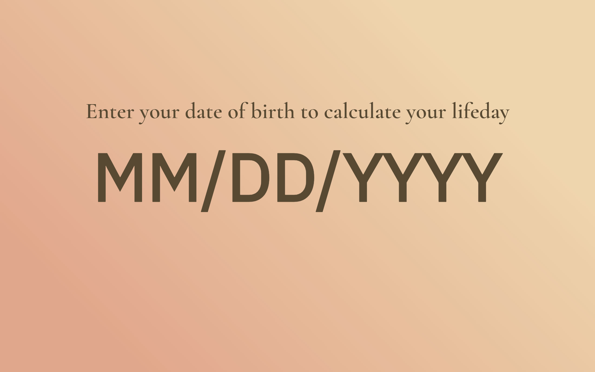

# Lifeday
A simple homepage that calculates how many days you've been alive.

Lifeday replaces your default new-tab page in Chrome with the number of days that you have been alive. The hope is that this will help to inspire you to make this day more meaningful, to waste less time, and to work towards those things that might fulfill you most.

You can install the chrome plugin [here](https://chrome.google.com/webstore/detail/lifeday/bjnakdpcancplfbpcgckhilkgdjbfdal)

If you are not using chrome, there is a web version of this repo located at [jcinis.github.io/lifeday](https://jcinis.github.io/lifeday) that you can set your browser homepage to.

Inspired as a synthesis between the [Motivation](https://github.com/maccman/motivation) Chrome extension by the multitalented [Alex MacCaw](https://twitter.com/maccaw), and music legend [Nick Cave](https://en.wikipedia.org/wiki/Nick_Cave) and his film [20000 Days on Earth](https://en.wikipedia.org/wiki/20,000_Days_on_Earth).

